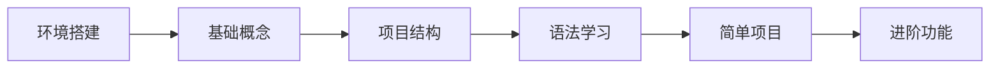
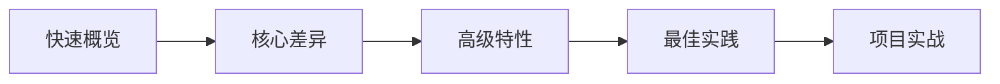

# README.md

# 微信小程序开发完整教程

欢迎来到微信小程序开发的完整学习资源库！这里包含了从零基础到高级应用的完整课程体系，帮助您系统性地掌握微信小程序开发技能。

## 📚 教程概览

本教程采用**循序渐进**的方式，通过**理论讲解 + 实战项目**的形式，让您能够：
- 🎯 掌握小程序开发的完整技能栈
- 💡 理解微信小程序的设计思想和最佳实践
- 🛠️ 具备独立开发完整小程序项目的能力
- 🚀 为求职面试和职业发展打下坚实基础

## 🗂️ 文档结构

```
wechat_param/
├── 微信小程序开发课程大纲.md          # 📋 完整课程大纲
├── docs/                            # 📖 详细学习文档
│   ├── 开发环境搭建指南.md             # 🛠️ 环境搭建详解
│   ├── 第1章-微信小程序概述.md         # 📱 小程序基础概念
│   ├── 第2章-小程序项目结构.md         # 🏗️ 项目架构详解
│   ├── 第3章-WXML语法和数据绑定.md     # 💻 模板语法详解
│   ├── 实践项目-基础练习.md            # 🎯 实战项目合集
│   └── 学习资源汇总.md                # 📚 资源推荐大全
└── README.md                        # 📋 本文件
```

## 🚀 快速开始

### 第一步：环境准备
1. 📖 阅读 [开发环境搭建指南](docs/开发环境搭建指南.md)
2. 🔧 注册微信小程序账号并获取AppID
3. 💻 下载安装微信开发者工具
4. ✅ 创建第一个Hello World项目

### 第二步：系统学习
按照以下顺序学习课程内容：

#### 🌟 基础阶段（第1-2周）
- [第1章：微信小程序概述](docs/第1章-微信小程序概述.md)
- [第2章：小程序项目结构](docs/第2章-小程序项目结构.md)

#### 🔥 核心阶段（第3-4周）
- [第3章：WXML语法和数据绑定](docs/第3章-WXML语法和数据绑定.md)
- 第4章：WXSS样式和布局（待补充）
- 第5章：基础组件详解（待补充）

#### ⚡ 进阶阶段（第5-8周）
- 第6章：JavaScript逻辑层（待补充）
- 第7章：微信小程序API（待补充）
- 第8章：自定义组件开发（待补充）

### 第三步：实战练习
完成 [实践项目](docs/实践项目-基础练习.md) 中的练习：
- 🎯 个人名片小程序
- 🧮 计算器小程序  
- ✅ 待办事项小程序

## 📖 学习路径

### 🎯 适合人群
- **前端初学者**：有HTML/CSS/JavaScript基础
- **前端开发者**：想要拓展小程序开发技能
- **后端开发者**：希望了解前端小程序开发
- **产品经理**：需要理解小程序技术实现

### 📈 学习建议

#### 对于初学者


#### 对于有经验的开发者


### ⏰ 时间安排
- **兼职学习**：每周8-10小时，12-16周完成
- **全职学习**：每天6-8小时，6-8周完成
- **速成模式**：每天10+小时，4-6周完成

## 🛠️ 技术栈

### 核心技术
- **WXML**：小程序模板语言
- **WXSS**：小程序样式语言
- **JavaScript**：逻辑层开发语言
- **微信API**：小程序专有接口

### 相关技术
- **云开发**：后端服务支持
- **组件化**：可复用组件开发
- **性能优化**：用户体验提升
- **工程化**：团队协作开发

## 📋 课程特色

### ✨ 内容特点
- **系统完整**：从基础到高级的完整知识体系
- **实战导向**：每个知识点都配有实际案例
- **循序渐进**：难度递增，适合不同水平的学习者
- **持续更新**：跟踪微信小程序最新特性

### 🎯 学习目标
完成本课程后，您将能够：
- ✅ 独立搭建小程序开发环境
- ✅ 熟练使用WXML、WXSS、JavaScript
- ✅ 掌握小程序的核心API和组件
- ✅ 具备完整项目的开发能力
- ✅ 理解小程序的性能优化方法
- ✅ 掌握小程序的发布和运营流程

## 🎯 实战项目

### 📱 基础项目
| 项目名称 | 难度 | 学习重点 | 预估时间 |
|---------|------|----------|----------|
| 个人名片 | ⭐ | 基础布局、数据绑定 | 2-3天 |
| 计算器 | ⭐⭐ | 事件处理、逻辑运算 | 3-5天 |
| 待办事项 | ⭐⭐ | 本地存储、列表操作 | 5-7天 |

### 🚀 进阶项目
| 项目名称 | 难度 | 学习重点 | 预估时间 |
|---------|------|----------|----------|
| 天气查询 | ⭐⭐⭐ | API调用、位置服务 | 1-2周 |
| 在线商城 | ⭐⭐⭐⭐ | 复杂交互、支付功能 | 2-3周 |
| 社交应用 | ⭐⭐⭐⭐ | 用户系统、实时通信 | 3-4周 |

## 🔧 开发工具

### 必备工具
- **微信开发者工具**：官方IDE，必需
- **VS Code**：代码编辑器，推荐
- **Chrome DevTools**：调试工具

### 推荐插件
```json
{
  "vscode插件": [
    "minapp - 小程序开发助手",
    "wechat-snippet - 代码片段",
    "Prettier - 代码格式化",
    "GitLens - Git增强"
  ]
}
```

## 📚 参考资源

### 官方资源
- [微信小程序官方文档](https://developers.weixin.qq.com/miniprogram/dev/framework/)
- [微信开发者工具](https://developers.weixin.qq.com/miniprogram/dev/devtools/download.html)
- [微信开放社区](https://developers.weixin.qq.com/community/)

### 学习资源
- [完整学习资源汇总](docs/学习资源汇总.md)
- [推荐书籍和视频教程](docs/学习资源汇总.md#📖-推荐书籍)
- [优秀开源项目](docs/学习资源汇总.md#📦-开源项目推荐)

## 🤝 参与贡献

### 如何贡献
1. 🍴 Fork 本项目
2. 🔧 创建功能分支 (`git checkout -b feature/new-content`)
3. 📝 提交更改 (`git commit -m 'Add new content'`)
4. 🚀 推送分支 (`git push origin feature/new-content`)
5. 📮 创建 Pull Request

### 贡献类型
- 📝 **内容补充**：添加新的章节或完善现有内容
- 🐛 **错误修正**：修复文档中的错误或不准确信息
- 💡 **建议优化**：提出改进建议或新的实践案例
- 🔗 **资源推荐**：推荐优质的学习资源

## 📞 获取帮助

### 常见问题
- 查看各章节的"常见问题"部分
- 搜索 [Issues](../../issues) 中的已知问题

### 交流讨论
- 💬 [GitHub Discussions](../../discussions) - 技术讨论
- 📧 邮箱：your-email@example.com
- 💬 微信群：扫描二维码加入学习群

### 问题反馈
遇到问题请通过以下方式反馈：
1. 📋 [创建 Issue](../../issues/new) 描述问题
2. 📧 发送邮件到技术支持邮箱
3. 💬 在学习群中提问讨论

## 📈 学习进度跟踪

### 进度检查清单
- [ ] 完成开发环境搭建
- [ ] 学完第1章：微信小程序概述
- [ ] 学完第2章：小程序项目结构
- [ ] 学完第3章：WXML语法和数据绑定
- [ ] 完成个人名片项目
- [ ] 完成计算器项目
- [ ] 完成待办事项项目
- [ ] ...（继续添加）

### 学习笔记建议
```markdown
## 学习日期：2025-XX-XX
### 今日学习内容
- 学习章节：
- 重点概念：
- 实践项目：

### 遇到的问题
- 问题描述：
- 解决方案：

### 明日计划
- 学习目标：
- 预计时间：
```

## 🎉 结语

微信小程序作为移动互联网的重要平台，掌握其开发技能对前端开发者来说非常重要。本教程致力于为您提供最完整、最实用的学习资源。

**记住**：
- 🎯 **实践是最好的老师** - 多动手编码，少纸上谈兵
- 📚 **文档是最权威的资料** - 遇到问题先查官方文档
- 🤝 **交流促进成长** - 积极参与社区讨论
- 🔄 **持续学习更新** - 跟上技术发展步伐

祝您学习愉快，早日成为微信小程序开发高手！🚀

---

## 📊 项目状态


**最后更新时间**：2025年8月10日  
**当前版本**：v1.0.0  
**维护状态**：🟢 积极维护中
